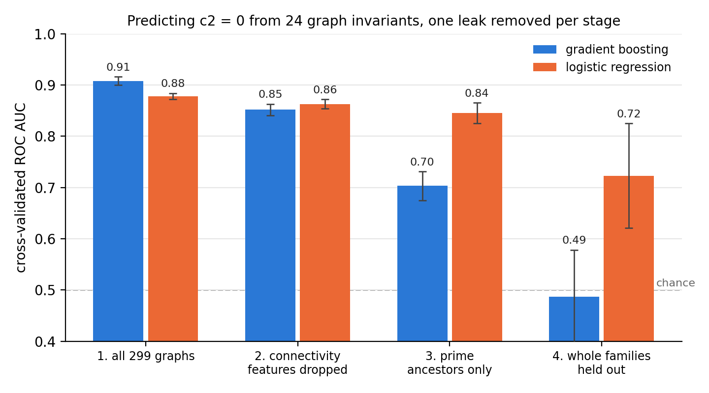

# Auditing an attribution result against known mathematics

A classifier predicts, from 24 elementary graph invariants, whether a primitive φ⁴
Feynman graph has vanishing c₂ invariant (conjecturally, the signature of a drop in the
weight of its Feynman period). On the complete catalogue of 299 graphs through 9 loops it
reaches cross-validated ROC AUC **0.91**, and permutation importance ranks vertex
connectivity first.

Unlike most ML benchmarks, here part of the ground truth is known: some of the
mechanisms producing c₂ = 0 are theorems. That makes the score and its explanation
checkable. Checking them shows the score was built mostly from known mathematics:

1. **The top feature restates a theorem.** Every graph with a 3-vertex cut is a
   *product*, and products have c₂ = 0. All 50 such graphs are positive. Removing the
   connectivity features: 0.85–0.86.
2. **Products also hide.** Of the remaining 72 positives, 57 reduce to a product after
   double-triangle reductions, which preserve c₂. Restricting to graphs whose reduced
   form (*ancestor*) is a single irreducible graph: 117 graphs, 15 positive. A linear
   model still scores 0.85, while gradient boosting drops to 0.70.
3. **Families leak.** Those 15 positives come from only 4 ancestor families, and the label
   is constant on a family. Random folds put siblings on both sides of the split. Holding
   out whole families: logistic regression **0.72 ± 0.10**; gradient boosting is at chance.



What survives is a weak cross-family signal measured on four positive families. The
ceiling is the mathematics: through 10 loops there are 283 irreducible families,
and exactly **7** have c₂ = 0 (stage 5 below).

## Why this is relevant to AI safety

<!-- DRAFT: rewrite in your own words -->
Interpretability and auditing produce explanations of model behaviour that are hard to
verify, because the true mechanism is usually unknown. Mathematics supplies settings
where it is known, at least in part. Here, a high score with a clean attribution was
correct but uninformative: the model had found the most prominent *known* mechanism,
and the evaluation rewarded recognising near-duplicates. Both failure modes are
generic, and neither is visible without ground truth to audit against.

## Results

Generated by `make reproduce` (also in [`results/SUMMARY.md`](results/SUMMARY.md)). ROC AUC
with 5-fold cross-validation repeated 20 times, mean ± std over repeats.

| stage | data | n (c₂ = 0) | gradient boosting | logistic | shuffled labels |
|---|---|---|---|---|---|
| 1 | all graphs, L = 3…9 | 299 (122) | 0.908 ± 0.008 | 0.878 ± 0.006 | 0.51 / 0.51 |
| 2a | products removed (vertex connectivity 4 only) | 249 (72) | 0.846 ± 0.014 | 0.785 ± 0.010 | 0.48 / 0.49 |
| 2b | all graphs, connectivity features dropped | 299 (122) | 0.852 ± 0.011 | 0.863 ± 0.009 | 0.51 / 0.51 |
| 3 | prime ancestors only | 117 (15) | 0.703 ± 0.028 | 0.845 ± 0.020 | 0.52 / 0.50 |
| 4 | prime ancestors, whole families held out | 117 (15) | 0.487 ± 0.091 | 0.723 ± 0.102 | 0.49 / 0.49 |
| 5 | all irreducible families, L = 6…10 | 283 (7) | 0.960 ± 0.011 | 0.963 ± 0.011 | 0.48 / 0.51 |

Notes:

- **Stage 4** is underpowered. With 4 positive families, 41 of 100 test folds contain no
  positive and cannot be scored; the spread across repeats is large.
- **Stage 5** has one graph per family, so ordinary folds already hold out families. The 7
  positives are separable from the other 276, mostly by symmetry: median |Aut| is 48
  versus 2, and the adjacency spectrum has 6 distinct eigenvalues versus 11. With seven
  positives this describes the known cases; it is not a criterion.

## Reproduce

```bash
pip install -r requirements.txt       # Python >= 3.10
make reproduce                         # ~2 min on a laptop
make test
```

`make reproduce` downloads the data file from arXiv (5.7 MB, checksum-verified), builds
both datasets, runs every stage and writes `results/` and `figures/`. If you already have
the file: `make reproduce PERIODS=/path/to/Periods`.

## Data and labels

The only external input is the `Periods` ancillary file of Panzer and Schnetz,
*The Galois coaction on φ⁴ periods* ([arXiv:1603.04289](https://arxiv.org/abs/1603.04289)).
It is downloaded, not redistributed.

- **Graphs.** The file lists every completed primitive φ⁴ graph through 11 loops except
  products. `phi4audit/census.py` reads the 249 non-products with L ≤ 9 and regenerates
  the 50 products by gluing smaller graphs along triangles. The per-loop counts
  (1, 1, 2, 5, 14, 49, 227) match Schnetz's census and are checked in `tests/`.
- **Labels.** c₂ = 0 from the file's c₂ annotation; c₂ = 0 for products by theorem.
- **Checks.** `tests/` recomputes c₂ by brute-force point counting over F₂ and F₃ for
  every graph with L ≤ 6. An earlier, independent computation with Schnetz's
  denominator reduction (HyperlogProcedures in Maple, not included here) agrees on all
  299 labels.
- **Families.** `phi4audit/graphs.py` implements the reduction to the ancestor
  (double-triangle reductions and product splits). The result does not depend on the
  order of moves; `tests/` checks this on several random orders.

Two differences from the run presented at EEML 2026 (0.90 → 0.85 → 0.72–0.74): the
spanning-tree feature there depended on vertex labelling and is now an isomorphism
invariant (minimum over decompletions), and every stage now uses the same repeated
cross-validation. The numbers quoted in the talk moved by at most 0.04; gradient
boosting on the 117 prime ancestors, not quoted there, moved by up to 0.06.

## Layout

```
phi4audit/periods.py        parse and download the Periods file
phi4audit/graphs.py         canonical forms, primitivity, products, ancestor reduction
phi4audit/features.py       the 24 graph invariants
phi4audit/census.py         build both datasets
phi4audit/cv.py             the evaluation protocol
phi4audit/c2_bruteforce.py  c2 by point counting (independent label check)
scripts/build_data.py       → data/built/*.csv
scripts/run_audits.py       → results/, figures/
tests/                      census counts, theorem checks, confluence, brute-force c2
```

## Background

Adding one vertex to a primitive φ⁴ graph makes it 4-regular (its *completion*), and the
completion has no edge cut of size ≤ 4 other than those isolating a single vertex. All
graphs here are completions, with loop order L = V − 2.
Its Feynman period is a number that generically has weight 2L − 3 in multiple zeta
values; on rare graphs the weight is lower. The c₂ invariant is
c₂(G)ₚ = #{Ψ_G = 0 over Fₚ} / p² mod p, where Ψ_G is the Kirchhoff polynomial. It is
conjectured that the weight drops exactly when c₂ = 0.

## References

- E. Panzer, O. Schnetz, *The Galois coaction on φ⁴ periods*, arXiv:1603.04289.
- O. Schnetz, *Quantum periods: a census of φ⁴-transcendentals*, arXiv:0801.2856.
- F. Brown, O. Schnetz, *A K3 in φ⁴*, arXiv:1006.4064.
- S. Hu, O. Schnetz, J. Shaw, K. Yeats, *Further investigations into the graph theory of
  φ⁴-periods and the c₂ invariant*, arXiv:1812.08751.
- A. Davies et al., *Advancing mathematics by guiding human intuition with AI*,
  Nature 600 (2021).

<!-- DRAFT: say how AI assistance was used, in your own words -->
Part of the invited talk *ML for Mathematics*, EEML 2026 ([slides](LINK)). Code written
with AI assistance; the mathematics, the audit design and every result were checked by
the author.
